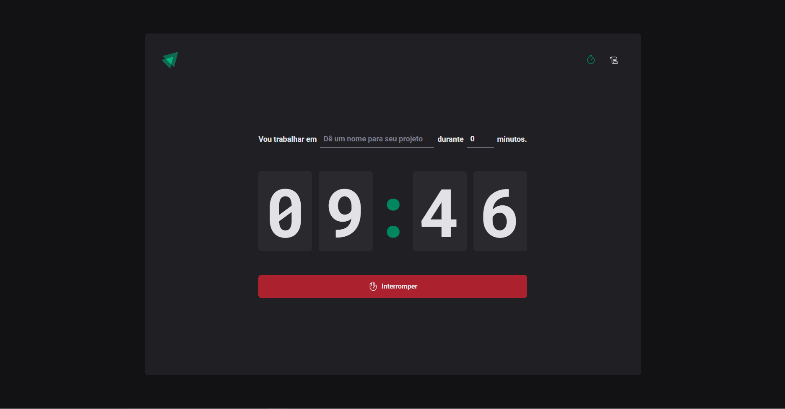
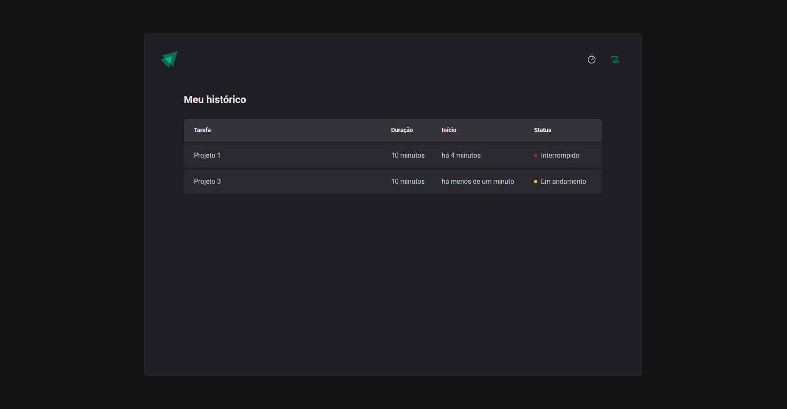

<h1 align="center"> Ignite Feed </h1>

  
   
  

## 🔨 Tecnologias

Esse projeto foi desenvolvido com as seguintes tecnologias:

- TypeScript
- React
- Styled Components
- Vite
##

- Feito com base em aulas da Rocketseat [🚀](https://www.rocketseat.com.br)